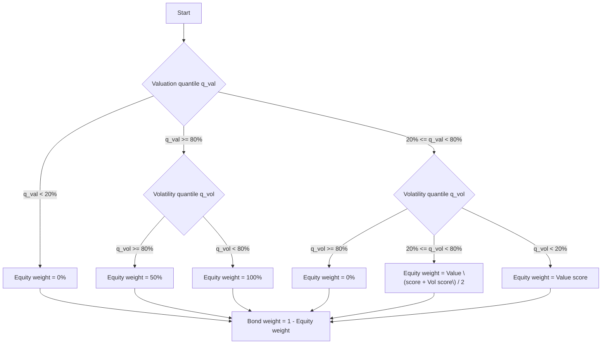

```mermaid
flowchart TD
    A[Start] --> B{Valuation quantile q_val}
    B -- "q_val < 20%" --> E0["Equity weight = 0%"]
    B -- "q_val >= 80%" --> C{Volatility quantile q_vol}
    B -- "20% <= q_val < 80%" --> D{Volatility quantile q_vol}

    C -- "q_vol >= 80%" --> E50["Equity weight = 50%"]
    C -- "q_vol < 80%"  --> E100["Equity weight = 100%"]

    D -- "q_vol >= 80%"      --> E0b["Equity weight = 0%"]
    D -- "20% <= q_vol < 80%" --> Eavg["Equity weight = Value \(score + Vol score\) / 2"]
    D -- "q_vol < 20%"       --> Eval["Equity weight = Value score"]

    E0 --> F["Bond weight = 1 - Equity weight"]
    E50 --> F
    E100 --> F
    E0b --> F
    Eavg --> F
    Eval --> F

```

**Scores (clipped to [0,1]):**
- Value score = (q_val − 0.20) / (0.80 − 0.20)
- Vol score   = (0.80 − q_vol) / (0.80 − 0.20)

**Bond weight** = 1 − Equity weight.
